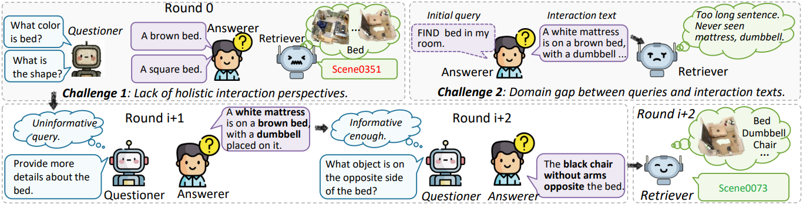
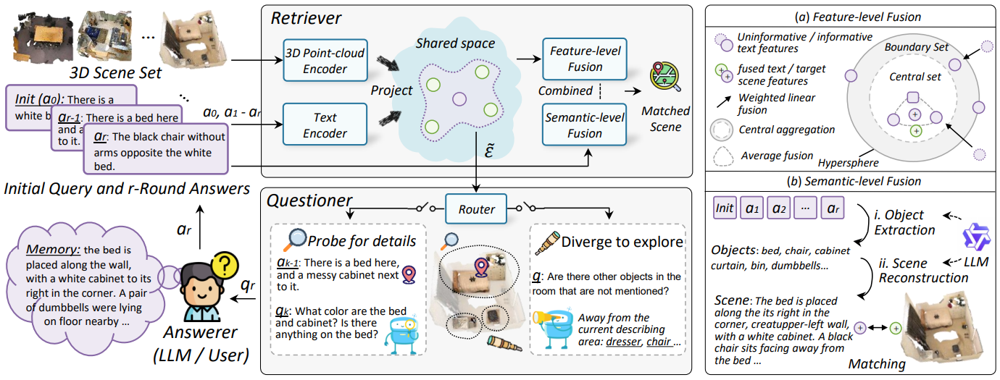

# IDeal
The original implementation version of NeurIPS 2025 paper [**Interactive Cross-modal Learning for Text-3D Scene Retrieval**](https://openreview.net/pdf?id=fohuurA03P). 😀

## Abstract
Text-3D Scene Retrieval (T3SR) aims to retrieve relevant scenes using linguistic queries. Although traditional T3SR methods have made significant progress in
capturing fine-grained associations, they implicitly assume that query descriptions are information-complete. In practical deployments, however, limited by the capabilities of users and models, it is difficult or even impossible to directly obtain a perfect textual query suiting the entire scene and model, thereby leading to performance degradation. To address this issue, we propose a novel Interactive Text-3D Scene Retrieval Method (IDeal), which promotes the enhancement of the alignment between texts and 3D scenes through continuous interaction. To achieve this, we present an Interactive Retrieval Refinement framework (IRR), which employs a questioner to pose contextually relevant questions to an answerer in successive rounds that either promote detailed probing or encourage exploratory divergence within scenes. Upon the iterative responses received from the answerer, IRR adopts a retriever to perform both feature-level and semantic-level information fusion, facilitating scene-level interaction and understanding for more precise re-rankings. To bridge the domain gap between queries and interactive texts, we propose an Interaction Adaptation Tuning strategy (IAT). IAT mitigates the discriminability and diversity risks among augmented text features that approximate the interaction text domain, achieving contrastive domain adaptation for our retriever. Extensive experimental results on three datasets demonstrate the superiority of IDeal. 

## Challenge 🖊
Extending existing static interactive methods to Text–3D Scene Retrieval faces two major challenges:


## Method


## Requirements ⚙️
following [RoMa](https://github.com/Yangl1nFeng/RoMa), the complex training and testing sets of this work have already been fully preprocessed by us, so the requirements for external libraries are not complex:
- python 3.8.16
- open3d 0.17.0
- pyTorch 1.12.1
- torchvision 0.13.1
- numpy 1.24.3
- transformers
- tensorboard_logger

## Data 📕
We follow RoMa for the use of query data to ensure fair and comprehensive evaluation.  
(The data files will be released soon.)

## Evaluation 🥧

### Interaction Adaptation Tuning
(The code files will be released soon.)

### Interactive Retrieval
(The code files and the execution workflow will be released soon.)

## Reference 🤗
If this paper is helpful for your research, please cite:
```bibtex
@inproceedings{fenginteractive,
  title={Interactive Cross-modal Learning for Text-3D Scene Retrieval},
  author={Feng, Yanglin and Li, Yongxiang and Sun, Yuan and Qin, Yang and Peng, Dezhong and Hu, Peng},
  booktitle={The Thirty-ninth Annual Conference on Neural Information Processing Systems}
}
```
```bibtex
@article{feng2025pointcloud,
  title={Pointcloud-text matching: Benchmark dataset and baseline},
  author={Feng, Yanglin and Qin, Yang and Peng, Dezhong and Zhu, Hongyuan and Peng, Xi and Hu, Peng},
  journal={IEEE Transactions on Multimedia},
  year={2025},
  publisher={IEEE}
}
```
Feel free to reach out for discussion or collaboration: fcyzfyl@163.com